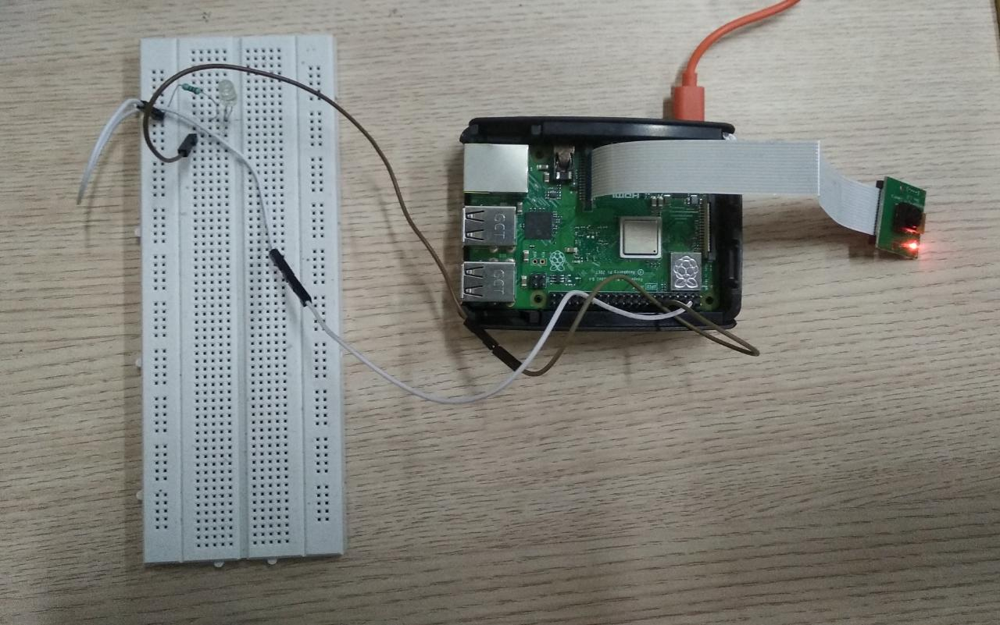
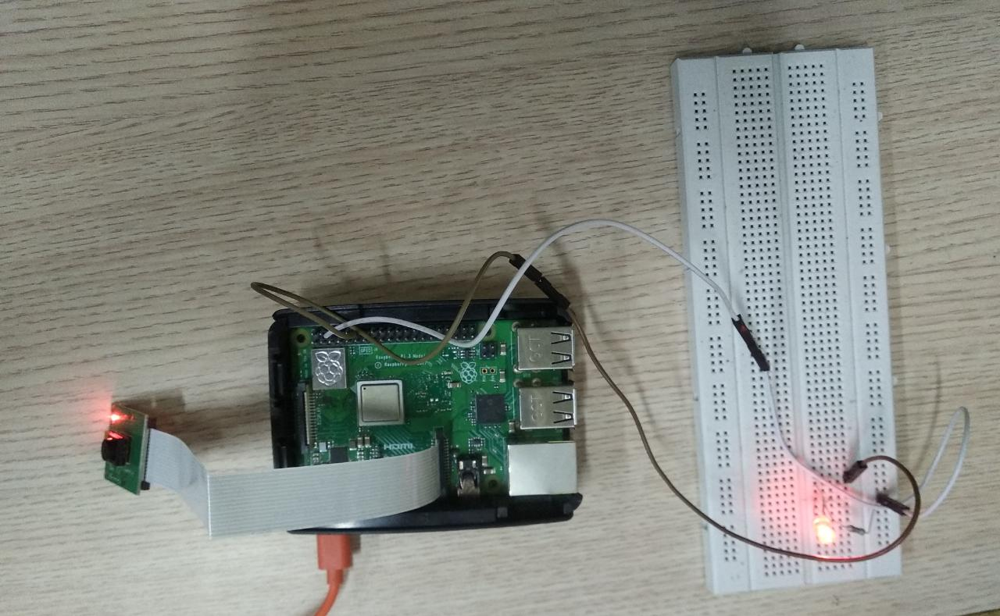
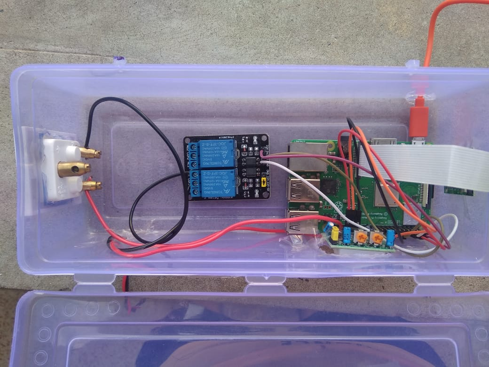
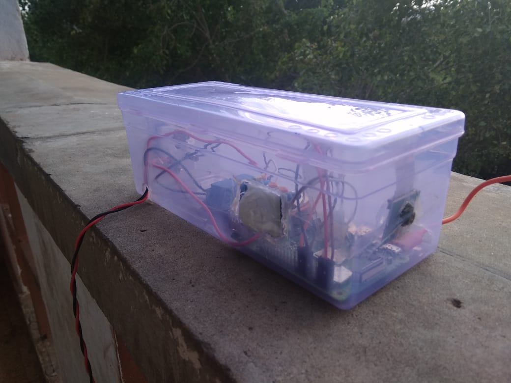
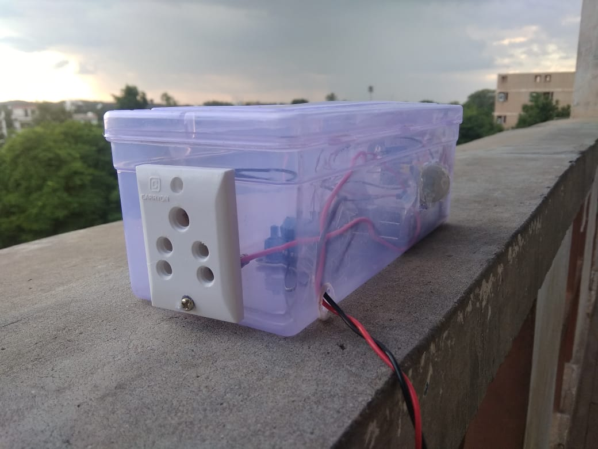

<h2>Setup</h2>

1) clone repository: https://github.com/digitalbrain79/darknet-nnpack
2) install opencv using pip command
3) configure the output to the gpio pins using description in other file
4) details of how to run it could be found here: https://pjreddie.com/darknet/yolo/

<h2>Images of connections in black box </h2>

  
  

<h2>Images of final black box </h2>

  
  
  

<h2>Working Video</h2>

